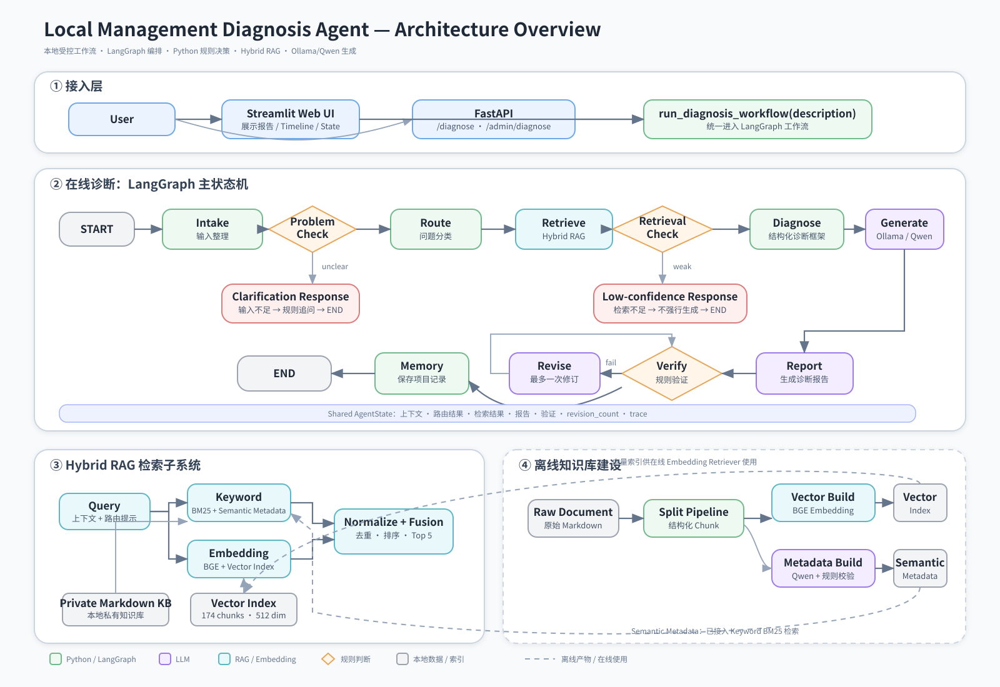
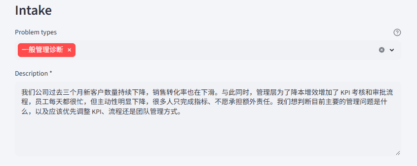
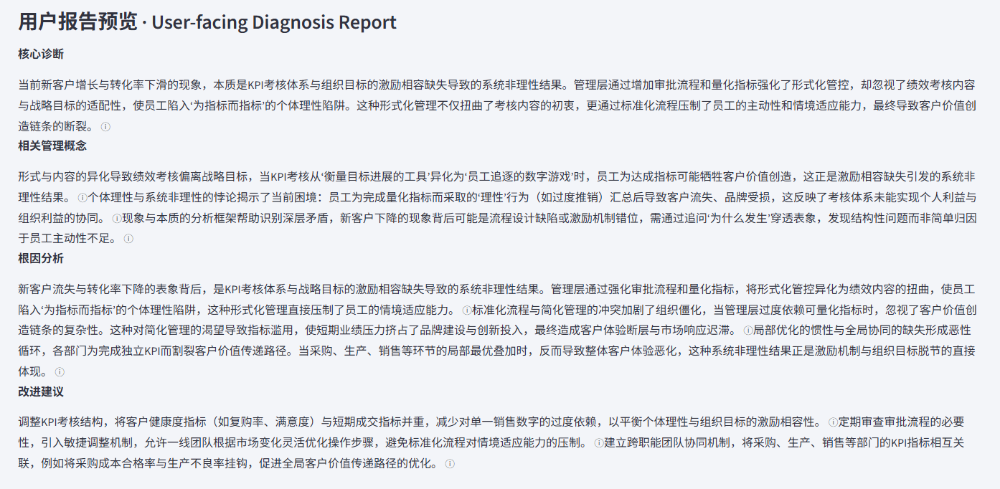

# Drucker Knowledge Base / Management Diagnosis RAG

## 1. Project Overview

This project is an experimental RAG and knowledge-engineering system for management diagnosis. It indexes Drucker-oriented Markdown knowledge, retrieves relevant evidence for a structured business problem, and uses a local language model to draft a diagnosis with source-item references. The project is primarily a test bed for corpus design, retrieval, evidence grounding, and structured generation—not a production-ready autonomous agent.

## 2. Motivation & Problem

Management questions are often underspecified and span several related concepts, such as customer value, opportunity, strategy execution, metrics, responsibility, and long-term decisions. The project explores how to turn a short intake description into a retrieval-ready query, select useful knowledge units, and produce a diagnosis that separates evidence, hypotheses, root causes, and recommendations. The experiments focus on whether retrieval and output structure improve usefulness without presenting general management knowledge as confirmed company facts.

## 3. Key Features
- Evidence-grounded management diagnosis
- Experimental chunking and retrieval pipeline
- Structured generation and validation
- End-to-end diagnosis workflow

The current implementation supports Markdown ingestion, section-aware chunking, BM25 and embedding retrieval, hybrid fusion, optional semantic metadata, local Ollama generation, per-section source references, validation, targeted regeneration, checkpointed execution, and SQLite persistence. Query understanding has raw, rule-based, and LLM rewrite modes, but the recorded experiments show that query rewriting is not yet a clear improvement.

## 4. System Architecture

<p align="center">
  <a href="docs/drucker_agent_architecture_overview.svg">
    
  </a>
</p>

The system separates user interaction, knowledge preparation, retrieval, generation and validation, and infrastructure into clear functional layers.

The main diagnosis flow is:

`User Intake → Retrieval → Evidence Selection → Structured Generation → Validation / Recovery → Diagnosis Report`

Knowledge preparation is handled separately through document ingestion, section-aware chunking, metadata enrichment, and BM25/vector indexing. The runtime then uses these prepared retrieval assets to construct evidence-grounded diagnosis reports.

## 5. Codebase Architecture

```text
app/
├── agent/                 LangGraph workflow, state, checkpoints, and node orchestration
├── core/                  Configuration and logging
├── database/              SQLite connection, schema, and diagnosis repository
├── frontend/              Streamlit intake, execution controls, and inspection UI
├── llm/                   Ollama client and generation-call metrics
└── tools/
    ├── ingestion/         Markdown loading, chunkers, metadata, and artifact storage
    ├── retrieval/         BM25, embeddings, hybrid fusion, RRF, and optional reranking
    ├── understanding/     Intake normalization, problem routing, language, and query modes
    ├── generation/        Context assembly, prompts, report schema, and JSON recovery
    ├── validation/        Section completion, citation, parse, and termination checks
    └── persistence/       Diagnosis history storage

data/
├── sample_knowledge_base/ Small example corpus used by the project
└── .../chunking_strategy_experiments/
                            Reproducible corpus and vector-index variants
evaluation/                 Chunking, retrieval, understanding, and generation benchmarks
tests/                      Unit and integration tests for the application boundaries
```

## 6. Experimental Design

The evaluation corpus contains 48 retrieval cases covering management themes represented in the knowledge base. Retrieval experiments report hit rate, recall, precision, MRR, nDCG, evidence coverage, evidence density, and latency at several cutoffs. Generation experiments use the local `qwen3:8b` model through Ollama and evaluate faithfulness, answer relevancy, and diagnosis quality with the repository's evaluation scripts.

### 6.1 Chunking Experiments

The repository compares fixed-size, recursive, section-based, section-recursive, and section-semantic chunkers, with and without sentence overlap. The strongest configuration recorded in the later experiments is section-semantic chunking with a roughly 900-character target, 300–1200 character bounds, sentence-boundary overlap of about 180 characters, and semantic breakpoint selection. One representative run produced 142 chunks with a median length of 950 characters and a 9.5% overlap ratio.

### 6.2 Retrieval Experiments

Retrieval compares BM25, sentence-transformer embeddings using `BAAI/bge-small-zh-v1.5`, linear hybrid fusion, and RRF-based runtime retrieval. Additional experiments test semantic metadata, weighted versus unweighted metadata, and BGE cross-encoder reranking. The production retrieval artifacts currently point to the semantic-overlap/180-character variant; the application retrieves a small final context (normally top 5) from a larger candidate pool.

### 6.3 Generation & Validation Experiments

The generation benchmark completed 48/48 cases with top-5 retrieved context and an initial-generation-only configuration. Reports are generated as four structured sections: core diagnosis, management concepts, root causes, and recommendations. Validation checks section presence and non-empty content, valid knowledge-item references, normal model termination, and successful structured parsing; the workflow can regenerate failed sections, although the initial benchmark did not exercise the validation-revision loop.

## 7. Key Results & Observations

### 7.1 Chunking Results

Section-aware semantic chunking with overlap performed best among the main chunking strategies tested.

Under the same linear-hybrid retrieval setup, the representative semantic-overlap run achieved **Hit@1 0.479**, **Hit@5 0.875**, and **Recall@5 0.576**, compared with **Hit@1 0.354** and **Recall@5 0.479** for fixed-size 900-character chunks.

Section-based and section-recursive variants were also competitive, but the results favored preserving document structure and sentence boundaries while introducing moderate overlap.

### 7.2 Retrieval Results

Hybrid retrieval consistently outperformed lexical-only and embedding-only retrieval in the evaluated settings.

On the representative semantic-overlap corpus, linear hybrid reached **Hit@5 0.875** and **nDCG@5 0.481**, compared with **0.771 / 0.382** for BM25 and **0.750 / 0.384** for embedding retrieval.

On the selected overlap-180 corpus with unweighted metadata, linear hybrid further reached **Hit@1 0.583**, **Hit@5 0.896**, **MRR@5 0.708**, and **nDCG@5 0.514**.

Adding semantic metadata to BM25 also improved **Hit@1 from 0.417 to 0.646** in a direct comparison. The tested BGE reranker did not improve the benchmark results and was therefore not retained as part of the final retrieval strategy.

### 7.3 Generation Observations

Across 13 evaluated generated reports, the mean scores were **0.869 faithfulness**, **0.954 answer relevancy**, and **0.962 diagnosis quality**.

The results suggest that the current retrieval context and structured generation process can support coherent and relevant diagnosis drafts. However, the evaluation does not establish consistently reliable factual accuracy.

The most common issue was unsupported specificity, where some reports introduced numerical thresholds or expressed hypotheses too confidently.

Generation is therefore treated as an experimental synthesis layer whose quality remains dependent on retrieval context, evidence calibration, and validation.

## 8. Demo Showcase

### 8.1 Intake Example

The following example describes a management scenario in which customer acquisition and sales conversion have declined while stronger KPI controls and approval processes have increased internal workload and reduced employee initiative.

<p align="center">
  
</p>

### 8.2 Diagnosis Report Example

Based on the retrieved management knowledge, the system generates a structured diagnosis covering the core problem, relevant management concepts, root causes, and improvement recommendations.

<p align="center">
  
</p>

## 9. Limitations & Future Roadmap

### 9.1 Current Limitations

- The knowledge base and evaluation cases are limited, curated, and domain-specific.
- Retrieval metrics measure benchmark relevance, not business usefulness in deployment.
- Generation evaluation is small and model-judged; faithfulness is imperfect and unsupported details still occur.
- Local Ollama models, embedding indexes, and experiment artifacts are environment-dependent.
- The system does not verify company facts, perform causal analysis, or replace management judgment.
- The current workflow contains orchestration and persistence features, but the central research contribution is the RAG and knowledge-engineering pipeline.

### 9.2 Future Roadmap

- Expand and improve the evaluation set, including harder cross-section and multilingual cases.
- Compare chunking and metadata choices with stable fixed corpora and repeated runs.
- Improve citation-aware generation, uncertainty labeling, and unsupported-claim detection.
- Evaluate the validation/revision loop separately from initial generation.
- Add human evaluation of diagnosis usefulness and recommendation applicability.
- Improve experiment reproducibility, artifact versioning, and configuration documentation before considering broader deployment.
